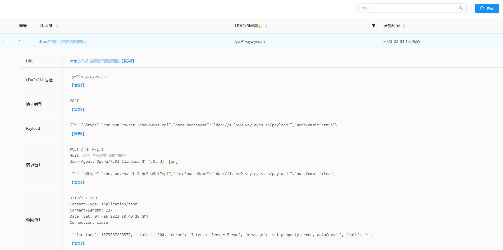

## 简介

**作者：** 小狐狸FM

**项目：** https://github.com/smallfox233/JsonExp

**版本：** 1.2

```
1. 根据现有payload，检测目标是否存在fastjson或jackson漏洞（工具仅用于检测漏洞）
2. 若存在漏洞，可根据对应payload进行后渗透利用
3. 若出现新的漏洞时，可将最新的payload新增至txt中（需修改格式）
```

## 使用

| 参数 | 别名      | 作用                                             | 例子                                |
| ---- | --------- | ------------------------------------------------ | ----------------------------------- |
| -u   | --url     | 指定目标url                                      | -u http://www.test.com              |
| -uf  | --urlfile | 指定目标url文档，每行一个url                     | -uf url.txt                         |
| -f   | --file    | 指定payload文本路径，默认为template/fastjson.txt | -f payload.txt                      |
| -t   | --type    | 指定HTTP请求类型，默认为post                     | -t get                              |
| -l   | --ldap    | 指定ldap地址                                     | -l xxx.xxx.xxx:8080                 |
| -r   | --rmi     | 指定rmi地址                                      | -r xxx.xxx.xxx:8080                 |
| -c   | --cookie  | 指定cookie值                                     | --cookie "name=xxx;sessionid=xxxxx" |

**windows系统**

```
在JsonExp.exe目录打开cmd界面

检测单个站点:
JsonExp -u [目标] -l [LDAP服务地址]

根据文本检测多个站点:
JsonExp -uf [目标.txt] -l [LDAP服务地址]
```

**Linux系统**

```
添加权限:
chmod +x JsonExp

检测单个站点:
./JsonExp -u [目标] -l [LDAP服务地址]

根据文本检测多个站点:
./JsonExp -uf [目标.txt] -l [LDAP服务地址]
```


### DNSlog检测


若出现dnslog回弹，可根据前面的编号去寻找对应的payload

```
编号.地址
```


### LDAP检测

若为**内网环境**/**目标无法DNS解析**时，可使用工具在 **本地/云服务器**起一个LDAP服务

https://github.com/WhiteHSBG/JNDIExploit

将**域名**换成**IP:端口**即可（上图中使用的是8090作为LDAP服务端口）


此时LDAP服务器可收到**路径**信息，可根据路径信息来定位触发漏洞的payload


### Payload介绍

默认的payload保存在template文件夹下

**格式：** `{.........$type$://$ip$/路径....}#注释内容`

```
$type$	用于指定ldap或rmi服务类型
$ip$	用于指定ldap地址或rmi地址
路径	若LDAP服务器地址为IP时，需要通过不同的路径来定位触发漏洞的payload
```

**注意：**

```
1. 每行分为两个部分，一个是漏洞利用的payload，另一个部分是注释
2. payload必须写在注释的前面
3. 注释符#及其之后的内容，将会在检测时被忽略
4. 若payload为多行，则需将其中的换行符删去，保证一个payload占据一行
```

### 结果展示功能

输出结果参考自`xray`，模板路径为`template/report.html`，请勿删除该文件

执行程序后，将会在`result`目录下生成`域名.html`或`ip.html`文件


